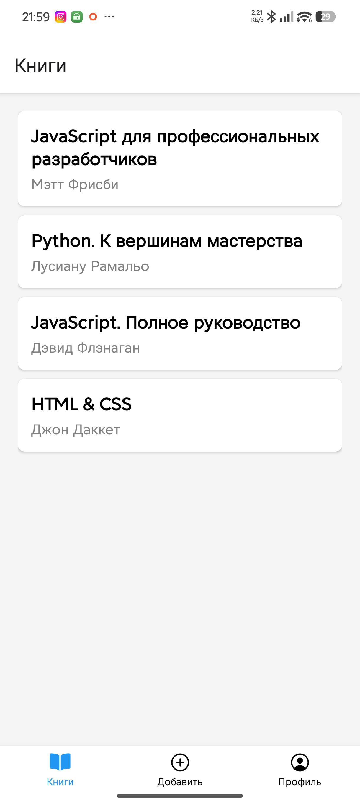

# 📚 BookTracker

BookTracker — это мобильное приложение для iOS и Android, созданное с помощью React Native и Expo. Оно помогает вести личный список прочитанных книг, автоматически подтягивая информацию об авторах из интернета.



## ✨ Ключевые возможности

- **Умное добавление:** Введите название книги, и приложение автоматически найдет её автора через **Google Books API** (если поле автора оставить пустым).
- **Ручной ввод:** Возможность добавлять книги полностью вручную, если нужной книги нет в сети.
- **Локальное хранилище:** Все добавленные книги надежно сохраняются в памяти устройства с помощью `AsyncStorage` — данные не пропадут после закрытия приложения.
- **Глобальное состояние:** Мгновенное обновление списков и статистики на всех экранах благодаря `Context API`.
- **Управление списком:** Удаление книг долгим нажатием на карточку (с окном подтверждения).
- **Интерфейс:** Удобная навигация с использованием нижних вкладок (Bottom Tabs) и стеков (Stack Navigation), а также кастомные иконки.

## 🛠 Технологический стек

- **Фреймворк:** [React Native](https://reactnative.dev/)
- **Среда разработки:** [Expo](https://expo.dev/)
- **Язык:** TypeScript
- **Навигация:** React Navigation (Stack & Bottom Tabs)
- **Сеть:** Fetch API (интеграция с Google Books)
- **Хранилище:** `@react-native-async-storage/async-storage`

## 🚀 Как запустить проект локально

1. Убедитесь, что у вас установлен Node.js.
2. Склонируйте репозиторий и перейдите в папку проекта:
    ```bash
    git clone <url_вашего_репозитория>
    cd BookTracker
    ```
